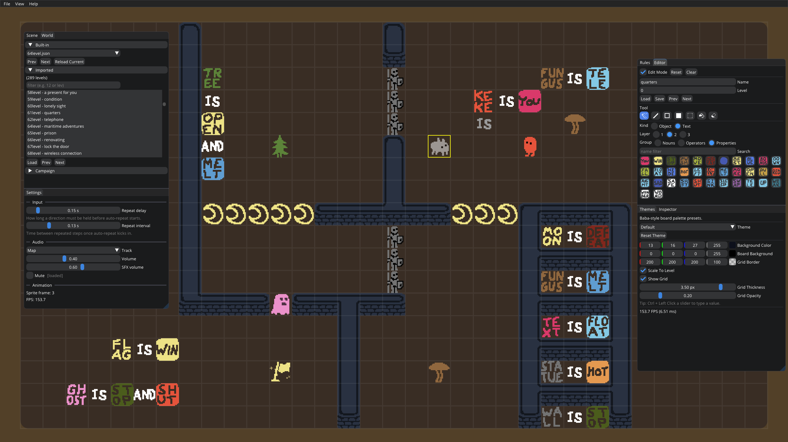
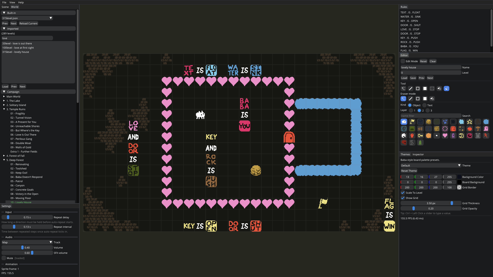

# Yet Another Baba-Is-You Clone

> This project is just for programming practice.  
> [Buy Baba Is You on Steam](https://store.steampowered.com/app/736260/Baba_Is_You/)

A from-scratch C++23 remake of *Baba Is You*, built on raylib + Dear ImGui.





## Build

```sh
git submodule update --init --recursive
cmake -S . -B build -G Ninja
cmake --build build
```

## Run

```sh
"./build/Baba Is You"
```

Always launch from the repo root - the binary resolves assets relative to
the current working directory.

## Toolchain

- CMake >= 3.30
- Clang with libc++ (the project hardcodes `-stdlib=libc++`)
- C++23, no `import std;` (classic `#include` only)

## Layout & Controls

- ` (backtick) toggles the ImGui overlay; the game viewport fills the
  window when it's hidden.
- The View menu has **Save Layout** and **Reset Layout** for the docked
  panels.
- Movement: arrow keys / WASD. **Z** undoes (hold to repeat). **R**
  resets the level (also undoable).
- **E** enters edit mode; **Q** leaves it.
